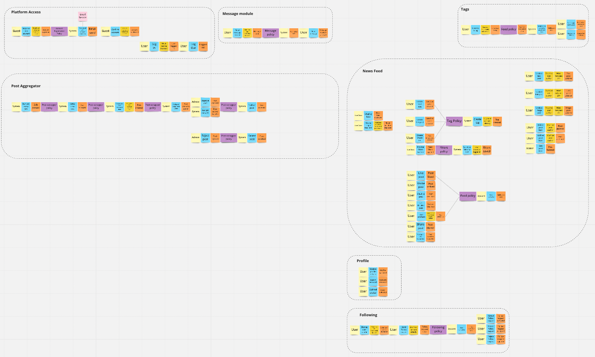

# Krater API

> The "Krater" is nothing but a copy of a reddit-like app. The project was created for the purpose of learning Domain Driven Design, a Modular Monolith and event driven architecture.

## Architectural Drivers 🏎

## C4 Model 📡

## Modular Monolith 🗄
The project uses rush.js to treat each module as a separate package from the node.js perspective.

## Domain Driven Design 👨🏼‍💼

In order to better understand and implement the application, Domain Driven Design (DDD) was used both from the strategic and tactical side.

### Strategic Part 🙊
When it comes to discovering the `domain`, getting to know the `actors` and likely `bounded contexts`, the Event Storming technique was used.

A full session snapshot can be found at the [Miro Board link](https://miro.com/app/board/uXjVOf_KGfs=/?invite_link_id=737256182042).

### Tactical Part 💻

## Event Driven Architecture ✉️

### Single module events 📦

### Module communication with Outbox Pattern 📤